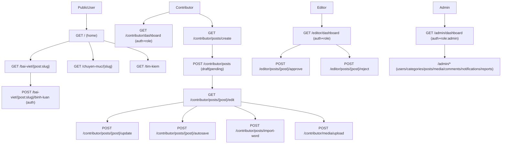

# Walkthrough dự án `enews` (Laravel)

Tài liệu này map theo luồng **route → middleware → controller → model → view → DB**, để bạn đọc dự án nhanh và đúng “đường đi nước bước”.

## Tổng quan kiến trúc

- **Frontend (public)**: đọc bài, xem chuyên mục, tìm kiếm nâng cao, trang tĩnh, bình luận.
- **Back office theo role**:
  - **Contributor**: viết bài (draft/pending), autosave, import Word, upload media, revision history.
  - **Editor**: duyệt/từ chối bài pending.
  - **Admin**: dashboard thống kê + CRUD users/categories/posts/media/comments/notifications + reports/export CSV.
- **Phân quyền thực tế**: chủ yếu bằng middleware `role:*` (file `app/Http/Middleware/CheckRole.php`), admin được “all abilities” qua `Gate::before` (file `app/Providers/AppServiceProvider.php`).

## Sơ đồ luồng chính

---

## Flow 1: Frontend đọc bài / chuyên mục / trang chủ

### Trang chủ
- **Route**: `GET /` (`home`)
- **Controller**: `app/Http/Controllers/HomeController.php@index`
- **Model**:
  - `Post::published()` + `with(['category','author'])` để lấy bài hiển thị
  - section theo slug chuyên mục (mảng slug hardcode)
- **View**: `resources/views/frontend/home.blade.php`

### Trang chuyên mục
- **Route**: `GET /chuyen-muc/{slug}` (`category`)
- **Controller**: `app/Http/Controllers/CategoryController.php@show`
- **Model**: `Category::active()->roots()` cho sidebar; `Post::published()->where(category_id)->paginate(12)`
- **View**: `resources/views/frontend/category.blade.php`

### Chi tiết bài viết
- **Route**: `GET /bai-viet/{post:slug}` (`post.show`) (Route Model Binding theo `slug`)
- **Controller**: `app/Http/Controllers/PostController.php@show`
- **Model**:
  - Nếu `status === published` → `increment('view_count')`
  - Load: `author`, `category`, `comments` (scope `approved()`)
  - Related posts: cùng category, limit 4; Recent posts: toàn site, limit 6
- **View**: `resources/views/posts/show.blade.php`
  - Có “review bar” approve/reject dành cho `admin/editor` khi bài `pending`
  - Có TTS (Web Speech API) + reading progress bar

### Bình luận
- **Route**: `POST /bai-viet/{post:slug}/binh-luan` (`post.comment`) + middleware `auth`
- **Controller**: `app/Http/Controllers/PostController.php@storeComment`
- **Model**: `Comment::create([post_id,user_id,content,is_approved])`
- **View render**: nằm trong `resources/views/posts/show.blade.php` (list comments đã approved)

---

## Flow 2: Tìm kiếm nâng cao

- **Route**: `GET /tim-kiem` (`search`)
- **Controller**: `app/Http/Controllers/SearchController.php@index`
- **Model**:
  - Chỉ query khi có filter (keyword/author/date_from/date_to/category_id)
  - `Post::published()->search($filters)->with(['author','category'])->paginate(10)`
  - Logic filter nằm ở `app/Models/Post.php@scopeSearch`
- **View**: `resources/views/frontend/search.blade.php`

---

## Flow 3: Auth + Profile

### Đăng nhập / Đăng xuất (local)
- **Routes**:
  - `GET /login` + `POST /login` (guest)
  - `POST /logout` (auth)
- **Controller**: `app/Http/Controllers/Auth/LoginController.php`
  - Login bằng `email` hoặc `username`
  - Chặn `status != active`
  - Nếu login bằng email và không phải admin → yêu cầu domain `@agu.edu.vn` hoặc `@student.agu.edu.vn`
  - Redirect theo role: admin/editor/contributor → dashboard tương ứng
- **View**: `resources/views/auth/login.blade.php` (được gọi từ `showLoginForm()`)

### Google OAuth
- **Routes**:
  - `GET /auth/google`
  - `GET /auth/google/callback`
- **Controller**: `app/Http/Controllers/AuthController.php`
  - Tạo `state` chống CSRF
  - Exchange code → access token → `userinfo`
  - Check domain trong `GOOGLE_ALLOWED_DOMAINS`
  - User mới tạo mặc định role `reader`

### Profile + avatar
- **Routes** (auth):
  - `GET /profile/{id?}` (`profile`)
  - `POST /profile/{id}/avatar` (`profile.avatar`)
- **Controller**: `app/Http/Controllers/ProfileController.php`
  - Chỉ admin được xem profile người khác
  - Avatar upload: crop/cover xuống 400×400, lưu `storage/app/public/avatars/*`
- **Views**:
  - Fallback chung: `resources/views/profile/index.blade.php`
  - Theo role: `resources/views/profile/roles/{reader,contributor,editor}.blade.php`

---

## Flow 4: Contributor viết bài (draft/pending) + autosave + import Word + media + revisions

### Dashboard contributor
- **Route**: `GET /contributor/dashboard` (`contributor.dashboard`) + middleware `auth` + `role:contributor,admin,editor`
- **Controller**: `app/Http/Controllers/ContributorController.php@dashboard`
- **Model**:
  - Lấy bài theo tác giả: `Post::where('author_id', auth()->id())`
  - Stats theo `status` + sum `view_count`
- **View**: `resources/views/dashboard/contributor.blade.php`

### Create/Edit bài
- **Routes**:
  - `GET /contributor/posts/create` (`contributor.posts.create`)
  - `POST /contributor/posts` (`contributor.posts.store`)
  - `GET /contributor/posts/{post}/edit` (`contributor.posts.edit`)
  - `POST /contributor/posts/{post}/update` (`contributor.posts.update`)
- **Controller**: `app/Http/Controllers/Contributor/PostController.php`
  - Form dùng chung view `resources/views/contributor/posts/create.blade.php`
  - Nút submit quyết định `draft` vs `pending`
  - Thumbnail: Intervention Image scaleDown(1200), lưu `storage/app/public/thumbnails/{userId}/*.jpg`
  - Sau mỗi save/update/autosave sẽ `saveRevision()` vào `post_revisions`
- **Policy**: `app/Policies/PostPolicy.php` (được gọi bằng `$this->authorize('update'|'delete', $post)`)

### Autosave
- **Route**: `POST /contributor/posts/{post}/autosave`
- **Controller**: `Contributor/PostController@autosave`
- **View-side**: JS trong `resources/views/contributor/posts/create.blade.php` gọi mỗi 30s nếu có `postId`

### Import Word
- **Route**: `POST /contributor/posts/import-word`
- **Controller**: `Contributor/PostController@importWord`
- **Logic**: đọc `.docx/.doc`, lấy đoạn text đầu tiên làm title, còn lại wrap `
...
`

### Media (CKEditor upload + library)
- **Routes**:
  - `POST /contributor/media/upload` (`contributor.media.upload`) (CKEditor field `upload`)
  - `GET /contributor/media/personal` (`contributor.media.personal`) (JSON list)
  - `GET /contributor/media/shared` (`contributor.media.shared`) (JSON list)
  - `GET /contributor/media/{media}/view` (`contributor.media.view`) (trả file)
- **Controllers**:
  - Upload (CKEditor): `Contributor/PostController@uploadMedia`
  - Listing + view: `app/Http/Controllers/Contributor/MediaController.php`
- **Model**: `app/Models/Media.php`

---

## Flow 5: Editor duyệt / từ chối bài

- **Routes**:
  - `GET /editor/dashboard` (`editor.dashboard`) + middleware `auth` + `role:editor,admin`
  - `POST /editor/posts/{post}/approve` (`editor.posts.approve`)
  - `POST /editor/posts/{post}/reject` (`editor.posts.reject`)
- **Controller**: `app/Http/Controllers/EditorController.php`
  - Approve: set `status=published` + `published_at=now()` (để bài xuất hiện ở public qua `Post::published()`)
  - Reject: set `status=rejected`
- **View**: `resources/views/dashboard/editor.blade.php`

---

## Flow 6: Admin quản trị (CRUD + reports/export)

### Dashboard
- **Route**: `GET /admin/dashboard` (`admin.dashboard`) + middleware `auth` + `role:admin`
- **Controller**: `app/Http/Controllers/AdminController.php@dashboard`
- **View**: `resources/views/admin/dashboard.blade.php`

### Posts / Categories / Users
- **Routes (prefix `admin`, auth + role:admin,editor)**:
  - `Route::resource('posts', Admin\\PostController)->except(show,create,store,update)`
  - `Route::resource('categories', Admin\\CategoryController)->except(show)`
- **Admin-only**:
  - `Route::resource('users', Admin\\UserController)->except(show)`
- **Controllers**:
  - `app/Http/Controllers/Admin/PostController.php`
  - `app/Http/Controllers/Admin/CategoryController.php`
  - `app/Http/Controllers/Admin/UserController.php`
- **Views**:
  - `resources/views/admin/posts/index.blade.php`
  - `resources/views/admin/categories/index.blade.php`
  - `resources/views/admin/users/{index,create,edit}.blade.php`

### Media library (shared)
- **Routes**: `GET /admin/media`, `POST /admin/media/upload`, `DELETE /admin/media/{media}`, `GET /admin/media/{media}/view`
- **Controller**: `app/Http/Controllers/Admin/MediaController.php`
- **View**: `resources/views/admin/media/index.blade.php`

### Comment moderation
- **Routes**: `GET /admin/comments`, `POST /admin/comments/{comment}/approve|reject`, `DELETE /admin/comments/{comment}`
- **Controller**: `app/Http/Controllers/Admin/CommentController.php`
- **View**: `resources/views/admin/comments/index.blade.php`

### Notifications (CRUD + send)
- **Routes**: `GET/POST/PUT/DELETE /admin/notifications/*` + `POST /admin/notifications/{notification}/send`
- **Controller**: `app/Http/Controllers/Admin/NotificationController.php`
- **Model**: `app/Models/Notification.php` (`recipients` cast array, `sent_at` datetime)
- **Views**: `resources/views/admin/notifications/{index,create,edit}.blade.php`

### Reports + export CSV
- **Routes**:
  - `GET /admin/reports` (`admin.reports.index`)
  - `GET /admin/reports/export-csv` (`admin.reports.export-csv`)
- **Controller**: `app/Http/Controllers/Admin/ReportController.php`
- **View**: `resources/views/admin/reports/index.blade.php`

---

## Các “điểm lệch”/bug/rủi ro cần ưu tiên kiểm tra

### 1) Mismatch tác giả bài viết: `author_id` vs `user_id` (ảnh hưởng rất rộng)
- **DB + Model đúng**: `posts.author_id` (migration `database/migrations/2026_03_04_104751_create_posts_table.php`, model `app/Models/Post.php@author()`)
- **Nhưng** các chỗ sau đang dùng `user_id`:
  - `app/Http/Controllers/Contributor/PostController.php` set `$post->user_id = auth()->id()`
  - `app/Policies/PostPolicy.php` check `$post->user_id === $user->id`
  - `app/Http/Controllers/PostController.php@show` check `$post->user_id` khi bài chưa published
  - `app/Http/Controllers/Admin/ReportController.php@exportCsv` eager-load `user` (`Post::with(['category','user'])`)
- **Hệ quả thường gặp**: contributor tạo bài xong **không hiện** trong dashboard (vì dashboard query `author_id`), authorize update/delete có thể fail, editor/admin xem pending có thể không đúng tác giả, export CSV thiếu “Người đăng”.

### 2) ProfileController dùng relation/field không tồn tại
- `app/Http/Controllers/ProfileController.php`:
  - gọi `$user->posts()` nhưng `app/Models/User.php` chưa có relation `posts()`
  - sum `views` nhưng schema đang là `view_count`
  - check role `'author'` trong khi role constants là `contributor/editor/admin/viewer/reader`
- Views role editor/contributor cũng có chỗ reference `$activity->user` (Post model hiện có `author`, không có `user`)

### 3) Comment moderation logic vs public comment create
- Admin moderation hiểu:
  - `is_approved = null` là **pending**
  - `true` là approved
  - `false` là rejected
- Nhưng public `PostController@storeComment` hiện đang tạo comment với `is_approved => true` (tức **auto-approved**), làm trang admin “pending” có thể luôn trống.

### 4) Media `file_path` không thống nhất giữa admin vs contributor
- Contributor upload lưu `file_path` **relative** kiểu `media/{userId}/file.ext`, rồi `Contributor\\MediaController@show` đọc từ `storage_path('app/public/' . $media->file_path)`.
- Admin upload lưu `file_path` dạng `'/storage/media/shared/xxx.ext'`, rồi `Admin\\MediaController@show` dùng `public_path($media->file_path)`.
- Nếu trộn 2 loại record trong cùng bảng `media`, rất dễ “đúng bên này sai bên kia”.

---

## File map nhanh (để debug nhanh)

- **Routes**: `routes/web.php`
- **Middleware role/status**: `app/Http/Middleware/CheckRole.php`
- **Models lõi**: `app/Models/{Post,Category,Comment,Media,Notification,PostRevision,User}.php`
- **Public controllers**: `app/Http/Controllers/{HomeController,CategoryController,PostController,SearchController}.php`
- **Contributor**: `app/Http/Controllers/Contributor/PostController.php`
- **Editor**: `app/Http/Controllers/EditorController.php`
- **Admin CRUD**: `app/Http/Controllers/Admin/*.php`
- **Layouts**: `resources/views/layouts/{app,admin}.blade.php`

